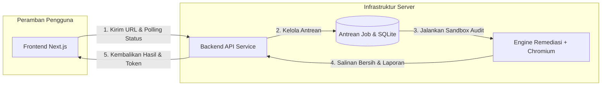

<div align="center">

# AksaraNetra

**Platform Audit dan Remediasi Aksesibilitas Digital Halaman Publik**

[](https://nextjs.org/)
[](https://react.dev/)
[](https://nodejs.org/)
[](https://playwright.dev/)
[](https://www.w3.org/WAI/standards-guidelines/wcag/)
[](LICENSE)

*Membantu pembaca dengan hambatan penglihatan mengakses informasi penting pada situs layanan publik Indonesia melalui audit terukur, perbaikan aman tanpa tebakan, dan tampilan bacaan ramah akses.*

</div>

---

## Ringkasan Proyek

**AksaraNetra** adalah alat bantu aksesibilitas web independen yang dirancang untuk memeriksa halaman web publik (seperti portal layanan pemerintah daerah), mengidentifikasi hambatan aksesibilitas berdasarkan standar **WCAG 2.1 Level A & AA**, menguji perbaikan kode secara aman (*deterministic non-destructive remediation*), dan menyajikan konten dalam tampilan **Reader** yang tenang, berkontras tinggi, serta ramah pembaca layar (*screen reader*).

### Prinsip Utama
1. **Tanpa Tebakan (*Zero Hallucination*)**: Gambar tanpa keterangan tidak ditebak isinya. Label tombol/tautan hanya diperbaiki bila terdapat bukti kontekstual yang jelas di dalam DOM atau konfigurasi situs terverifikasi.
2. **Situs Asli Tidak Disentuh**: Pemeriksaan dan remediasi dilakukan sepenuhnya pada salinan (*snapshot*) halaman di lingkungan sandbox.
3. **Privasi & Keamanan**: Hanya memeriksa halaman publik. Token akses audit disimpan di sisi klien (*client-side*), tidak memerlukan akun pengguna, dan data kedaluwarsa secara otomatis setelah 7 hari.

---

## Fitur Utama

- **Audit Aksesibilitas Terukur**: Evaluasi berbasis `axe-core` pada tiga masalah dominan:
  - `link-name` (tautan tanpa teks/nama deskriptif)
  - `button-name` (tombol ikon tanpa label)
  - `scrollable-region-focusable` (wadah gulir yang tidak bisa dijangkau papan tombol)
- **Engine Remediasi Deterministik**: Menerapkan patch DOM otomatis dengan tingkat keyakinan (*confidence*) tinggi, menandai kasus abu-abu untuk peninjauan manusia, dan memastikan nol regresi (*zero regression*).
- **Tampilan Ramah Akses (Reader View)**: Menata ulang konten menjadi satu kolom linier dengan hierarki judul yang jelas, palet warna berdaya kontras tinggi, dan tipografi **Atkinson Hyperlegible**.
- **Ekspor Laporan PDF**: Unduh ringkasan hasil audit terstruktur lengkap dengan perbandingan skor sebelum dan sesudah perbaikan.
- **Riwayat Klien 7 Hari**: Menyimpan catatan audit lokal di perangkat pengguna dengan kemampuan melanjutkan audit yang berjalan atau membersihkan riwayat kapan saja.

---

## Arsitektur Sistem

AksaraNetra terdiri dari tiga subsistem terintegrasi dalam monorepo:

```
AksaraNetra/
├── src/            # Frontend (Next.js 16 + React 19 + TypeScript + CSS Modules)
├── backend/        # Backend API & Job Queue (Node.js 22.5+ + SQLite)
├── engine/         # Remediation Engine (Playwright + Chromium + Axe-Core)
└── public/         # Aset statis, font Atkinson, dan data audit bawaan
```



---

## Teknologi yang Digunakan

| Komponen | Teknologi | Keterangan |
| --- | --- | --- |
| **Frontend** | Next.js 16.3, React 19, TypeScript | App Router, Server/Client Components, CSS Modules murni |
| **Tipografi** | Atkinson Hyperlegible | Huruf resmi Braille Institute untuk pembaca *low vision* |
| **Backend** | Node.js (>=22.5), `node:sqlite` | Built-in SQLite driver, lightweight single-worker queue |
| **Audit Engine** | Playwright, Chromium, `@axe-core/playwright` | Sandbox browser otomatis, inspeksi DOM, pengujian WCAG |
| **Kontainer** | Docker, Docker Compose | Deployment siap pakai untuk backend worker |

---

## Panduan Memulai Cepat (Local Development)

### Prasyarat
- **Node.js**: Versi `>= 22.5.0` (diperlukan untuk native `node:sqlite`)
- **npm**: Versi `>= 10.0.0`

### 1. Instalasi Engine & Browser Headless
```bash
cd engine
npm ci
npx playwright install --with-deps chromium
cd ..
```

### 2. Jalankan Backend
```bash
cd backend
cp .env.example .env
npm start
# Backend aktif di http://127.0.0.1:8787
```

### 3. Jalankan Frontend
Buka terminal baru di direktori root:
```bash
cp .env.example .env.local
npm ci
npm run dev
# Frontend aktif di http://localhost:3000
```

---

## Environment Variables

### Frontend (`.env.local`)
| Variabel | Deskripsi | Contoh Nilai |
| --- | --- | --- |
| `NEXT_PUBLIC_AUDIT_API_URL` | URL publik backend AksaraNetra | `http://127.0.0.1:8787` (local) / `https://api.aksaranetra.example` |

### Backend (`backend/.env`)
| Variabel | Deskripsi | Nilai Default |
| --- | --- | --- |
| `PORT` | Port server backend | `8787` |
| `HOST` | Host binding backend | `127.0.0.1` |
| `FRONTEND_ORIGINS` | Daftar origin yang diizinkan untuk CORS | `http://localhost:3000` | 
| `BACKEND_SECRET` | Kunci rahasia untuk token share & akses | *(String acak, min. 32 karakter di production)* |
| `BACKEND_DATA_DIR` | Direktori penyimpanan database SQLite & artefak | `./data` (atau `/data` dalam container) |


---

## Dokumentasi API Backend

| Metode | Rute | Deskripsi | Autentikasi |
| --- | --- | --- | --- |
| `POST` | `/audits` | Memulai job audit baru untuk suatu URL | Publik |
| `GET` | `/audits/cache?url=...` | Memeriksa ketersediaan hasil audit tersimpan | Publik |
| `GET` | `/audits/:jobId` | Memeriksa status proses audit yang sedang berjalan | `Bearer <accessToken>` |
| `GET` | `/audits/:jobId/result` | Mengambil data lengkap metrik dan perbaikan | `Bearer <accessToken>` |
| `DELETE` | `/audits/:jobId` | Membatalkan job yang sedang mengantre/berjalan | `Bearer <accessToken>` |
| `GET` | `/health` | Pemeriksaan kesehatan server (*healthcheck*) | Publik |

---

## Deployment Produksi

### Backend (Docker Compose)
Backend dikemas dengan Chromium headless untuk deployment di VPS atau cloud container (Render, Fly.io, dsb.):

```bash
# Build dan jalankan container backend
docker compose up -d --build

# Periksa log backend
docker compose logs -f
```

### Frontend (Vercel)
Frontend dapat di-deploy langsung ke Vercel:
1. Hubungkan repository GitHub ke Vercel.
2. Tambahkan Environment Variable: `NEXT_PUBLIC_AUDIT_API_URL` mengarah ke URL backend Anda.
3. Deploy menggunakan preset Next.js.

---

## Pengujian & Pemeriksaan Kualitas (Quality Checks)

Proyek ini dilengkapi dengan suite pengujian otomatis yang dijalankan di GitHub Actions:

```bash
# 1. Linting kode frontend
npm run lint

# 2. Build produksi Next.js
npm run build

# 3. Pengujian kontrak frontend
npm run test:frontend

# 4. Pengujian backend & database SQLite
npm run backend:check
npm run backend:test

# 5. Pengujian engine remediasi & rule aksesibilitas
npm run engine:test
```

---

## Aksesibilitas & Standar Etika

AksaraNetra dibangun dengan komitmen penuh terhadap inklusivitas digital:
- Diuji secara manual menggunakan pembaca layar **NVDA (NonVisual Desktop Access)**.
- Navigasi penuh melalui keyboard (*Skip to content link*, *focus-visible indicators*, *focus traps on dialogs*).
- Mendukung preferensi sistem `prefers-reduced-motion` untuk mematikan seluruh animasi dekoratif.
- Mengikuti pedoman **WCAG 2.1 Level A & AA**.

---

## Lisensi & Hak Cipta

Proyek ini didistribusikan di bawah lisensi **MIT License**. Lihat berkas [LICENSE](LICENSE) untuk ketentuan lengkap.

Pemberitahuan lisensi pihak ketiga dan adopsi standar tercantum di [THIRD_PARTY_NOTICES.md](THIRD_PARTY_NOTICES.md) dan [ADOPSI-LISENSI.md](ADOPSI-LISENSI.md).
